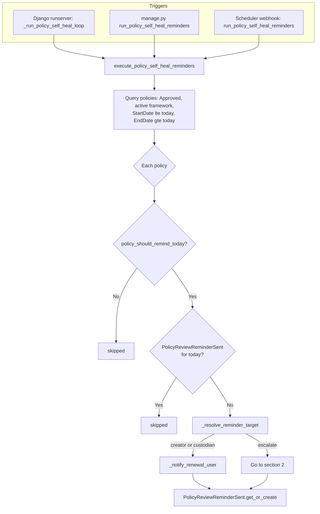
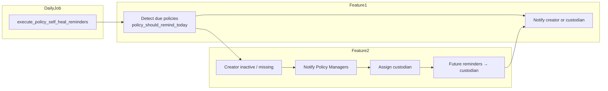

# Policy outdated detection and creator escalation

This document describes the two related features implemented for **outdated / due-for-review policies** (policy self-healing). Both are implemented in the same backend module and share scheduling and notification infrastructure.

| # | Feature | Summary |
|---|---------|---------|
| **1** | Outdated policy detection & renewal reminders | Scheduled job finds policies due for review and notifies the **creator** (or assigned **custodian**). |
| **2** | Creator unavailable → Policy Manager | When the creator cannot be resolved or is inactive, reminders go to **Policy Managers**, who assign a **renewal custodian**. |

**Note:** Policy **acknowledgement** (users who have not acknowledged a campaign) is a separate module (`policy_acknowledgement.py`) and is not covered here.

---

## Shared infrastructure

| Item | Location / value |
|------|------------------|
| Backend module | `grc_backend/grc/routes/Policy/policy_self_healing.py` |
| Models | `Policy`, `PolicyReviewReminderSent`, `PolicySelfHealEscalation` in `grc/models.py` |
| Migrations | `0006_policy_review_reminder_self_heal.py`, `0007_policy_self_heal_escalation.py` |
| Management command | `python manage.py run_policy_self_heal_reminders` |
| Inline scheduler | `grc/apps.py` → `_run_policy_self_heal_loop()` (when `ENABLE_POLICY_SELF_HEAL_SCHEDULER=true`) |
| External scheduler | POST `/api/policies/self-healing/reminders/run/` (header `X-Policy-Self-Heal-Secret`) |
| Settings | `POLICY_SELF_HEAL_CRON_SECRET`, `POLICY_SELF_HEAL_INTERVAL_SECONDS`, `POLICY_SELF_HEAL_SEND_EMAIL`, `FRONTEND_BASE_URL` |

---

## 1. Outdated policy detection and renewal reminders

### Purpose

Identify **approved, active** policies that are within their validity window (`StartDate` … `EndDate`) but need a **renewal review**, then remind the responsible user (creator or custodian) at most **once per calendar day**.

### When a policy is considered “due for review” today

Function: **`policy_should_remind_today(policy, today)`**

All must be true:

- Policy `Status == "Approved"`
- Policy `ActiveInactive` in `Active`, `Scheduled`, empty, or `null`
- Parent framework `Status == "Approved"` and `ActiveInactive == "Active"`
- `StartDate <= today <= EndDate` (policy not started yet or already past end date → skip)
- `EndDate` is set (required for renewal logic)

Then **either**:

- **Frequency:** `(today - StartDate).days % ReviewReminderFrequencyDays == 0` (default frequency: 30 days), or  
- **Final week:** `(EndDate - today).days` is between 0 and 7 (daily reminders in the last 7 days before end)

### Who receives the reminder

Function: **`_resolve_reminder_target(policy)`** — order of precedence:

1. **Custodian** — if a prior escalation was assigned and that user is still active  
2. **Creator** — if `resolve_policy_creator_user_id` finds an active user  
3. **Escalate** — see [§2 Creator unavailable → Policy Manager](#2-creator-unavailable--policy-manager)

Creator resolution: **`resolve_policy_creator_user_id(policy)`**

- Prefer latest `PolicyApproval.UserId` for the policy  
- Else match `Policy.CreatedByName` to `Users.UserName` (tenant-aware, with legacy fallback)

### Batch execution flow



### Notifications (creator / custodian path)

Function: **`_notify_renewal_user(...)`**

- DB row in `notifications` (`type`: `policy_review_self_heal` or `policy_self_heal_assigned`)
- Optional email via `NotificationService.send_multi_channel_notification` (`policyReviewSelfHeal` template)
- In-app entry in `notifications_storage` with metadata `type: policy_self_heal` and `action_url: /policy/renewal-review?policyId=...`

### User response (renewal review)

| Step | Function / endpoint | UI |
|------|---------------------|-----|
| Open review | — | `/policy/renewal-review?policyId={id}` — `PolicySelfHealReview.vue` |
| Approve (no change) | `policy_self_heal_decision` — `action: approve` | Keeps current version and dates |
| Start update | `policy_self_heal_decision` — `action: update` | Redirect to `/create-policy/tailoring?frameworkId=...&policyId=...&selfHeal=1` (`TT.vue`) |

Authorization for decision: **`_can_perform_self_heal_decision`** — creator **or** assigned custodian only.

### Key functions (section 1)

| Function | Role |
|----------|------|
| `execute_policy_self_heal_reminders` | Main daily batch |
| `policy_should_remind_today` | Outdated / due-for-review detection rules |
| `_resolve_reminder_target` | Choose creator, custodian, or escalate |
| `resolve_policy_creator_user_id` | Resolve creator user id |
| `_user_is_active` | Check user still active |
| `_notify_renewal_user` | Email + DB + in-app for creator/custodian |
| `_insert_db_notification` | Persist notification row |
| `_append_memory_notification` | In-app notification list |
| `run_policy_self_heal_reminders` | Webhook/cron API entry |
| `policy_self_heal_decision` | Approve or redirect to tailoring |
| `_can_perform_self_heal_decision` | Permission check for renewal actions |

### API routes

| Method | Path |
|--------|------|
| POST | `/api/policies/self-healing/reminders/run/` |
| POST | `/api/policies/{policy_id}/self-healing/decision/` |

### Frontend

| File | Role |
|------|------|
| `PolicySelfHealReview.vue` | Renewal review page |
| `Notifications.vue` | Deep link to renewal review |
| `TT.vue` | Tailoring submit when `selfHeal=1` |
| `api.js` | `POLICY_SELF_HEAL_DECISION` |

---

## 2. Creator unavailable → Policy Manager

### Purpose

When the system cannot send a renewal reminder to an **active creator** (and no active **custodian** is already assigned), **Policy Managers** are notified to **assign a renewal custodian**. After assignment, reminders and renewal decisions go to that custodian.

### When escalation happens

Inside **`_resolve_reminder_target`**, returns `("escalate", None)` when:

- No active **assigned custodian** (`_assigned_custodian_user_id` empty or user inactive), **and**
- Creator cannot be resolved (`resolve_policy_creator_user_id` returns `None`), **or**
- Creator user exists but **`_user_is_active(creator_id)`** is false

### Escalation batch flow (within same daily job)

```mermaid
flowchart TD
    E[execute_policy_self_heal_reminders] --> Target{_resolve_reminder_target}
    Target -->|escalate| M[_policy_manager_user_ids<br/>role Policy Manager, active, tenant]
    M --> P[_ensure_pending_escalation]
    P --> Row[PolicySelfHealEscalation<br/>status pending_assignment]
    Row --> Notify[_notify_policy_managers_escalation]
    Notify --> Email[Email to managers capped by<br/>POLICY_SELF_HEAL_MAX_MANAGER_EMAILS]
    Notify --> InApp[In-app: type policy_self_heal_manager<br/>action_url dashboard renewalEscalations=1]
    Notify --> Dedup[PolicyReviewReminderSent for today]

    subgraph ManagerUI
        D[Policy Dashboard<br/>renewal escalations panel]
        D --> L[list_pending_self_heal_escalations]
        L --> A[assign_self_heal_custodian]
        A --> U[Update Policy.CreatedByName<br/>escalation status assigned]
        A --> N2[_notify_renewal_user to assignee<br/>metadata policy_self_heal_assigned]
    end

    Notify -.-> D
    N2 -.-> R[/policy/renewal-review?assigned=1]
```

### Database

**Table:** `policy_self_heal_escalation`  
**Model:** `PolicySelfHealEscalation`

| Field | Meaning |
|-------|---------|
| `status` | `pending_assignment` → `assigned` |
| `original_created_by_name` | Creator name at escalation time |
| `assigned_user_id` | Custodian user id after manager assigns |
| `assigned_by_user_id` | Policy Manager who assigned |

### Manager actions

| Step | Function | What happens |
|------|----------|--------------|
| List pending | `list_pending_self_heal_escalations` | Policy Managers only (`_is_policy_manager`) |
| Assign custodian | `assign_self_heal_custodian` | Sets `Policy.CreatedByName`, marks escalation `assigned`, notifies assignee |
| Custodian reviews | `policy_self_heal_decision` | Same as creator — via `_can_perform_self_heal_decision` |

### Notifications (manager path)

Function: **`_notify_policy_managers_escalation`**

- Recipients: users with RBAC `role == "Policy Manager"` and `is_active == "Y"` (tenant-filtered when policy has `tenant_id`)
- DB type: `policy_self_heal_manager_escalation`
- In-app metadata: `type: policy_self_heal_manager`, link `/policy/performance/dashboard?renewalEscalations=1`

### Key functions (section 2)

| Function | Role |
|----------|------|
| `_resolve_reminder_target` | Returns `escalate` when creator/custodian unavailable |
| `_policy_manager_user_ids` | List active Policy Manager user ids |
| `_is_policy_manager` | RBAC check for manager-only APIs |
| `_escalation_table_available` | Guard if migration/table missing |
| `_pending_escalation` / `_assigned_escalation` | Load escalation row by status |
| `_assigned_custodian_user_id` | Custodian from assigned escalation |
| `_ensure_pending_escalation` | Create pending escalation record |
| `_notify_policy_managers_escalation` | Notify all managers for a policy |
| `list_pending_self_heal_escalations` | API: list for dashboard |
| `assign_self_heal_custodian` | API: assign user + notify custodian |

### API routes

| Method | Path |
|--------|------|
| GET | `/api/policies/self-healing/escalations/pending/` |
| POST | `/api/policies/{policy_id}/self-healing/assign-custodian/` |

### Frontend

| File | Role |
|------|------|
| `PolicyDashboard.vue` | `fetchRenewalEscalations`, `assignRenewalCustodian`, panel when `renewalEscalations=1` |
| `Notifications.vue` | Manager notifications → dashboard with `renewalEscalations=1` |
| `PolicySelfHealReview.vue` | Banner when `assigned=1` query param |
| `api.js` | `POLICY_SELF_HEAL_ESCALATIONS_PENDING`, `POLICY_SELF_HEAL_ASSIGN_CUSTODIAN` |

---

## End-to-end relationship



1. **Feature 1** runs every schedule tick and decides *which policies* need review and *whether* to notify creator/custodian or escalate.  
2. **Feature 2** is the branch when the creator is not available; after a manager assigns a custodian, **Feature 1** continues to target that custodian instead of escalating again.

---

## Configuration checklist

| Variable | Typical use |
|----------|-------------|
| `ENABLE_POLICY_SELF_HEAL_SCHEDULER` | `true` for Django inline loop; `false` if only Scheduler microservice calls the webhook |
| `POLICY_SELF_HEAL_INTERVAL_SECONDS` | `86400` prod; `60` dev testing |
| `POLICY_SELF_HEAL_CRON_SECRET` | Must match Scheduler webhook / POST body `secret` |
| `FRONTEND_BASE_URL` | Links in emails and notifications |
| `POLICY_SELF_HEAL_SEND_EMAIL` | `false` to disable SMTP only |
| `POLICY_SELF_HEAL_MAX_MANAGER_EMAILS` | Cap manager emails per policy per run (default 5) |

---

## File index

| Path |
|------|
| `grc_backend/grc/routes/Policy/policy_self_healing.py` |
| `grc_backend/grc/models.py` (`PolicyReviewReminderSent`, `PolicySelfHealEscalation`) |
| `grc_backend/grc/management/commands/run_policy_self_heal_reminders.py` |
| `grc_backend/grc/apps.py` |
| `grc_backend/grc/urls.py` (self-healing routes) |
| `grc_backend/backend/settings.py` (self-heal settings) |
| `grc_frontend/src/components/Policy/PolicySelfHealReview.vue` |
| `grc_frontend/src/components/Policy/PolicyDashboard.vue` |
| `grc_frontend/src/config/api.js` |
